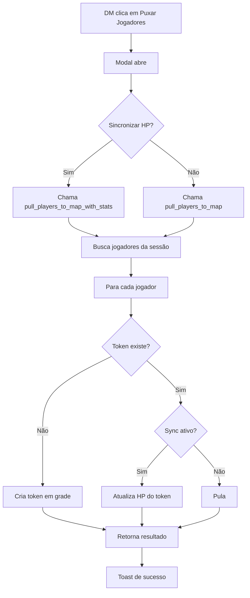

# Puxar Jogadores para o Mapa

## Visão Geral

Funcionalidade que permite ao DM adicionar automaticamente todos os jogadores da sessão ao mapa com um único clique, posicionando-os em grade sem colisões e opcionalmente sincronizando seus status (HP/PE/PS) das fichas de personagem.

## Funcionalidades

### 1. Posicionamento Automático
- Tokens são criados em grade 3x3
- Espaçamento de 80px entre tokens
- Posição inicial: (200, 200)
- Sem colisões entre tokens

### 2. Sincronização de Status (Opcional)
- Importa HP atual e máximo da ficha
- Importa PE atual e máximo (Ordem Paranormal)
- Importa PS atual e máximo (Ordem Paranormal)
- Atualiza tokens existentes com novos valores

### 3. Comportamento Inteligente
- Não cria tokens duplicados
- Não move tokens existentes
- Atualiza apenas status se token já existe
- Ignora o DM (apenas jogadores)

## Como Usar

### Passo 1: Abrir Modal
1. Entre na sessão como DM
2. Clique no botão "Puxar Jogadores" (ícone UserPlus) na toolbar
3. Modal de confirmação abre

### Passo 2: Configurar Opções
- **Sincronizar HP das fichas**: Marcado por padrão
  - ✅ Recomendado para iniciar combate
  - ❌ Desmarque se quiser apenas criar tokens vazios

### Passo 3: Confirmar
- Clique em "Puxar Jogadores"
- Aguarde processamento
- Tokens aparecem no mapa

## Funções SQL

### Versão Simples: pull_players_to_map
```sql
SELECT * FROM pull_players_to_map(
  p_session_id UUID,
  p_dm_id UUID
);
```

**Retorna:**
- `success`: TRUE/FALSE
- `tokens_created`: Número de tokens criados
- `message`: Mensagem de resultado

**Comportamento:**
- Cria tokens para jogadores sem token
- Posiciona em grade 3x3
- Não sincroniza HP

### Versão Avançada: pull_players_to_map_with_stats
```sql
SELECT * FROM pull_players_to_map_with_stats(
  p_session_id UUID,
  p_dm_id UUID
);
```

**Retorna:**
- `success`: TRUE/FALSE
- `tokens_created`: Número de tokens criados
- `tokens_updated`: Número de tokens atualizados
- `message`: Mensagem de resultado

**Comportamento:**
- Cria tokens para jogadores sem token
- Atualiza HP de tokens existentes
- Sincroniza com fichas de personagem
- Suporta D&D 5e e Ordem Paranormal

## Estrutura de Dados

### Tokens Criados
```typescript
{
  session_id: UUID,
  owner_id: UUID,        // ID do jogador
  image_url: string,     // Avatar do jogador
  label: string,         // Nome do jogador
  x: number,             // Posição X em grade
  y: number,             // Posição Y em grade
  width: 50,
  height: 50,
  token_type: 'player',
  hp_current: number,    // Da ficha (se sync ativo)
  hp_max: number,        // Da ficha (se sync ativo)
  pe_current: number,    // Da ficha OP (se sync ativo)
  pe_max: number,        // Da ficha OP (se sync ativo)
  ps_current: number,    // Da ficha OP (se sync ativo)
  ps_max: number         // Da ficha OP (se sync ativo)
}
```

## Exemplos de Uso

### Exemplo 1: Iniciar Combate
```typescript
// DM clica em "Puxar Jogadores"
// Deixa "Sincronizar HP" marcado
// Clica em "Puxar Jogadores"
// Resultado: Todos os jogadores aparecem no mapa com HP das fichas
```

### Exemplo 2: Adicionar Jogadores Sem HP
```typescript
// DM clica em "Puxar Jogadores"
// Desmarca "Sincronizar HP"
// Clica em "Puxar Jogadores"
// Resultado: Tokens criados sem HP (barras não aparecem)
```

### Exemplo 3: Atualizar HP de Tokens Existentes
```typescript
// Jogadores já estão no mapa
// DM clica em "Puxar Jogadores"
// Deixa "Sincronizar HP" marcado
// Clica em "Puxar Jogadores"
// Resultado: HP dos tokens é atualizado com valores das fichas
```

## Segurança

### Permissões
- Apenas o DM da sessão pode executar
- Verificação de DM feita no SQL (SECURITY DEFINER)
- Não é possível puxar jogadores de outras sessões

### Validações
```sql
-- Verifica se quem está chamando é o DM
IF NOT EXISTS (
  SELECT 1 FROM sessions 
  WHERE id = p_session_id AND dm_id = p_dm_id
) THEN
  RETURN 'Apenas o DM pode puxar jogadores';
END IF;
```

## Fluxo de Execução



## Troubleshooting

### Problema: "Apenas o DM pode puxar jogadores"
**Causa**: Usuário não é o DM da sessão
**Solução**: Verifique se está logado como DM correto

### Problema: "Nenhum jogador na sessão"
**Causa**: Não há jogadores participando da sessão
**Solução**: Convide jogadores antes de puxar

### Problema: HP não sincroniza
**Causa**: Jogadores não têm fichas criadas
**Solução**: Peça aos jogadores para criar suas fichas primeiro

### Problema: Tokens aparecem sobrepostos
**Causa**: Muitos jogadores (mais de 9)
**Solução**: Reposicione manualmente os tokens extras

## Melhorias Futuras

- [ ] Opção de escolher posição inicial
- [ ] Opção de escolher espaçamento
- [ ] Suporte para mais de 9 jogadores (grade maior)
- [ ] Opção de remover todos os tokens de jogadores
- [ ] Opção de reposicionar todos os tokens
- [ ] Sincronização bidirecional (token → ficha)
- [ ] Animação de aparecimento dos tokens
- [ ] Preview da posição antes de confirmar
